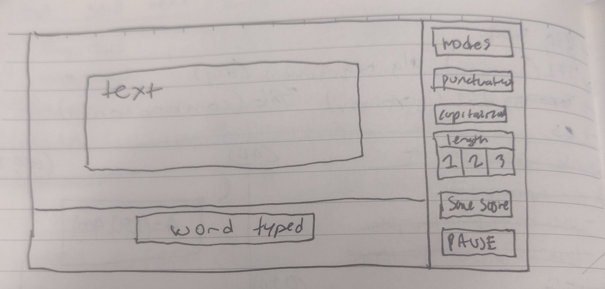
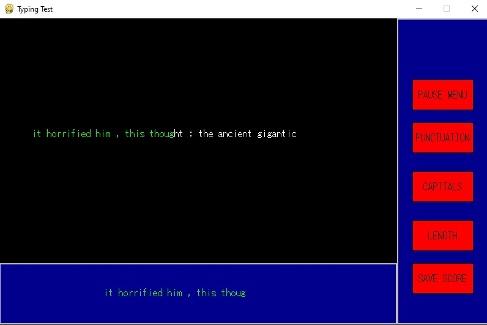

#  Typing Test 
## CS110 Final Project   Semester 2, 2024 

## Team Members

Noah Gell

## Project Description

A typing test. The program has a start menu, pause menu, and the test screen. On the test screen their are buttons that allow you to modify whether the text has punctuation or capitlization. The program is incomplete, the only parts that work are switching between game states, tokenizing sentences for the test from a text file using the nltk, and displaying whether user input matches the sentence. 

The test also has "Stats" screen accesible from the main menu, which was supposed to display a users progress by graphing their wpm and accuracy over time. (this data would be stored and accessed from a text file.) Since the test is unfinished, i just wrote the text file in order to display this part. 

***    

## GUI Design

### Initial Design

### Final Design

## Program Design

### Features
 
1. Menu and pause screen 
2. Test measures wpm (unsuccesful)
3. Test measures accuracy (unsucesful)
4. Abililty to turn of punctuation and casing for the test (unsucessful)
5. Ability to make the test shorter or longer (unsucessful)
6. Scores recorded, saved, and graphed to show typing speed progress over time. (unsuccesful)
7. colors display how far you are along in the sentence
8. typed sentence appears below the given sentence
9. the sentences are taken from a text

### Classes

- buttons: the buttons class creates butons on the screen, and returns when theyve been pressed down. they also change color based on whether the mousing is hovering or theyre clicked. 

- generate_sentences: this class uses the nltk module to tokenize a long text file into sentences, select one at random, and modify it according to modes. 

- startMenu: this class is the start menu game state, it draws a screen with buttons on it, the start button switches the state to "testScreen" and the quit button quits the game. 

- pauseS: this is the pause screen state, draws a screen with buttons, its buttons change to the "testScreen" and "startMenu" state respectively.

- testScreen: this is the main game state. it also draws a screen with buttons. this state is the condition to trigger the eventloop in the controller.

- -gamestates: this class controls the gamestates and contains two methods, one which gets the current game state and another which updates it. 

### Additional modules

- natural language toolkit (https://www.nltk.org/)

### ATP

## Test Case 1: Button hover colors
- **Description:** the buttons detect that the mouse is over them. 
- **Steps**
- 1. Start the game
- 2. Hover over the buttons on the main menu 
- **Expected Result:** the buttons change to a darker shade. 

## Test Case 2: Navigating Menus
- **Description:** game states change based on button presses without issues.  
- **Steps**
- 1. Start the game. 
- 2. Naviagate back and forth through the main menu, pause menu, and start screen. 
- **Expected Result:** the states change appropriately. 

## Test Case 3: Generating a sentence and bliting it on screen 
- **Description:** the sentence class extracts a sentence from a text file and it is displayed on screen. 
- **Steps**
- 1. Start the game. 
- 2. Navigate to test screen and press start
- **Expected Result:**  a sentence appears.  

## Test Case 4: Screen displays whether typed sentence is correct or not
- **Description:** the sentence on screen should change color based on what is typed. 
- **Steps**
- 1. Start the game, go to start screen and press start. 
- 2. type a few  letters correctly 
    - note that I could not get rid of some of the punctuation, and there are spaces between the words and commas. 
- 3. now try to delete what you typed.
- 4. type letters incorrectly, and try to use backspace again. 

- **Expected Result:** when characters are typed correclty, they show up in green and cannot be deleted. When typed incorrectly, the sentence becomes red and will stay red until the errors are deleted. 

## Test Case 5: Stopping the game. 
- **Description:** hitting the pause button will break out of the event loop.  
- **Steps**
- 1. Start the game, go to start screen and press start. 
- 2. start typing. 
- 3. press pause menu. 

- **Expected Result:** the event loop will be interrupted. unfortunately I wasn't able to create a real pause button, you wont be able to come back to the same screen. 

